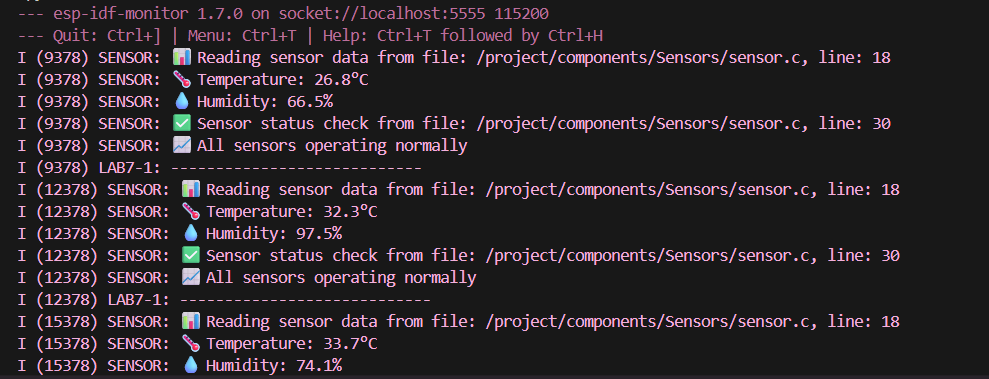

# Lab 7-1: Local Component Demo

## คำอธิบาย
การทดลองนี้แสดงการใช้งาน component ที่มีอยู่ในโฟลเดอร์ `components/Sensors/` ของ project

## สรุปคำสั่งที่ใช้ และผลลัพธ์ที่ได้

# เริ่มต้น Docker Container
docker-compose up -d

# ตรวจสอบ Docker Container

docker-compose ps -a

# ดูว่ามี NAME เป็น esp32-lab7 หรือไม่

# เข้าใช้งาน Container
docker exec -it esp32-lab7 bash

# เข้าไปใน project directory
cd lab7-1_Managed_Local_Component

# export environment เพื่อให้สามารถเรียกใช้ idf tools ได้
. $IDF_PATH/export.sh

# กำหนด target ESP32
idf.py set-target esp32

# Build project
idf.py build

# รัน QEMU (สำหรับการทดสอบ)
idf.py qemu monitor

